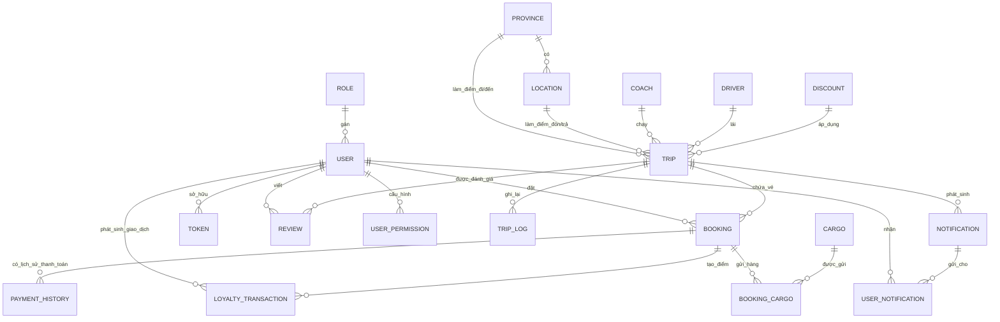

## 🚌 Hệ Thống Đặt Vé Xe Khách

### Giới Thiệu Dự Án

Hệ thống **Bus Ticket Booking System** là một ứng dụng **đặt vé xe khách trực tuyến** với phân tách rõ ràng giữa:

- **Backend**: RESTful API quản lý nghiệp vụ đặt vé, chuyến xe, khách hàng, cargo, điểm thưởng, báo cáo, thông báo, bảo mật và phân quyền.
- **Frontend**:
  - Ứng dụng **Customer**: cho khách hàng tìm chuyến, đặt vé, theo dõi trạng thái thanh toán, xem điểm thưởng, đánh giá chuyến đi.
  - Ứng dụng **Admin**: cho nhân viên/quản trị vận hành hệ thống, quản lý dữ liệu và xem báo cáo.

Dự án hướng tới mô hình **sản phẩm portfolio hoàn chỉnh**, có đầy đủ luồng nghiệp vụ: từ **tìm chuyến – đặt vé – thanh toán – tích điểm – báo cáo – thông báo realtime**.

---

## Kiến Trúc Hệ Thống

- **Kiểu kiến trúc tổng thể**:  
  - **Client–Server** với **2 ứng dụng React (Customer/Admin)** gọi tới **Spring Boot REST API**.
- **Kiến trúc backend**:
  - **Monolithic Application** với **Layered Architecture (Controller – Service – Repository – Entity)**.
  - **API RESTful** theo prefix `api/v1/**`.
  - **Bảo mật** bằng **Spring Security + JWT**, phân quyền theo người dùng và permission màn hình.
  - **Caching** ở tầng service (annotation `@Cacheable`, `@CacheEvict`).
  - **WebSocket** (STOMP) cho kênh realtime (`/chat`, `/topic`).
  - **OpenAPI/Swagger** cho tài liệu API.
  - **Async** bằng `@EnableAsync` và `ThreadPoolTaskExecutor`.
  - **Scheduler** bằng `@Scheduled` trong xử lý hoàn tất chuyến đi và tích điểm.
- **Kiến trúc frontend**:
  - Mỗi ứng dụng (Admin/Customer) là **SPA** sử dụng **React + Vite**.
  - **React Router** để routing.
  - **React Query** để quản lý state bất đồng bộ (server state) và caching dữ liệu từ API.
  - **Axios** làm HTTP client.
  - **Material UI (MUI)** cho UI component, kết hợp chart, table, form validation.
  - **i18next** cho đa ngôn ngữ.
  - **SockJS + STOMP** cho tương tác WebSocket với backend.

Luồng tương tác chính:

- **Customer / Admin Frontend** → gọi **Spring Boot API** qua HTTP (Axios).
- **Spring Boot API** → thao tác **MySQL** qua **Spring Data JPA**.
- Backend phát sinh **Notification**, **Loyalty Transaction**, **Payment History**, và đẩy realtime qua **WebSocket** tới frontend.

---

## Sơ Đồ Kiến Trúc

```mermaid
flowchart LR
    UserCustomer["Người dùng (Customer Web)"]
    UserAdmin["Nhân viên / Admin Web"]

    subgraph Frontend
        CFE["React + Vite (Customer)"]
        AFE["React + Vite (Admin)"]
    end

    subgraph Backend["Spring Boot Monolith"]
        API["REST API (Controller/Service)"]
        Auth["Spring Security + JWT"]
        WS["WebSocket (STOMP /chat, /topic)"]
        MailSvc["Mail Service (spring-boot-starter-mail)"]
        SmsSvc["SMS Service (Twilio SDK)"]
        Cache["Spring Cache (@Cacheable)"]
        OpenAPI["OpenAPI / Swagger UI"]
    end

    subgraph Database["Database"]
        MySQL["MySQL (Spring Data JPA)"]
    end

    UserCustomer --> CFE
    UserAdmin --> AFE

    CFE -->|HTTP/JSON (Axios)| API
    AFE -->|HTTP/JSON (Axios)| API

    API --> Auth
    API --> Cache
    API --> MySQL

    API --> MailSvc
    API --> SmsSvc
    API --> WS

    WS --> CFE
    WS --> AFE

    API --> OpenAPI
```

---

## Công Nghệ Sử Dụng

### Backend

Trích từ `pom.xml`:

- **Ngôn ngữ & Nền tảng**
  - Java 17
  - Spring Boot 3.4.1
- **Web & REST**
  - `spring-boot-starter-web`
- **Persistence & Database**
  - `spring-boot-starter-data-jpa`
  - `mysql-connector-j`
  - `com.google.cloud.sql:mysql-socket-factory-connector-j-8` (kết nối MySQL trên Cloud SQL)
- **Validation & Jackson**
  - `spring-boot-starter-validation`
  - `jackson-datatype-jsr310`
- **Bảo mật & JWT**
  - `spring-boot-starter-security`
  - `io.jsonwebtoken:jjwt-api`, `jjwt-impl`, `jjwt-jackson` (JWT)
- **Mail & Notification**
  - `spring-boot-starter-mail`
- **API Docs**
  - `springdoc-openapi-starter-webmvc-ui`
- **WebSocket & Realtime**
  - `spring-boot-starter-websocket`
- **Khác**
  - Lombok
  - `spring-boot-devtools`
  - `commons-codec`
  - `com.twilio.sdk:twilio` (tích hợp SMS)
- **Test**
  - `spring-boot-starter-test`

### Frontend – Admin (`busticketbookingsystem_FE/BusTicketBooking-Admin-main`)

Trích từ `package.json`:

- **Core**
  - React 18
  - React DOM
  - Vite
- **Routing & State bất đồng bộ**
  - `react-router-dom`
  - `@tanstack/react-query`, `@tanstack/react-query-devtools`
  - `@tanstack/react-table`
- **UI & UX**
  - `@mui/material`, `@mui/icons-material`, `@mui/lab`
  - `@mui/x-data-grid`, `@mui/x-date-pickers`
  - `react-toastify`
  - `react-pro-sidebar`
- **Biểu đồ & Thống kê**
  - `chart.js`
  - `react-chartjs-2`
- **Form & Validation**
  - `formik`
  - `yup`
- **I18n & tiện ích**
  - `i18next`, `react-i18next`, `i18next-browser-languagedetector`
  - `lodash.debounce`
  - `date-fns`
- **Realtime**
  - `sockjs-client`
  - `stompjs`
- **HTTP Client**
  - `axios`

### Frontend – Customer (`busticketbookingsystem_FE/BusTicketBooking-Customer-main`)

Trích từ `package.json`:

- **Core**
  - React 18
  - React DOM
  - Vite
- **Routing & State bất đồng bộ**
  - `react-router-dom`
  - `@tanstack/react-query`, `@tanstack/react-query-devtools`
  - `@tanstack/react-table`
- **UI & UX**
  - `@mui/material`, `@mui/icons-material`, `@mui/lab`, `@mui/x-date-pickers`
  - `react-toastify`
  - `swiper` (carousel)
  - `lucide-react`
- **Biểu đồ & QR**
  - `chart.js`
  - `react-chartjs-2`
  - `qrcode.react`, `react-qr-code`
- **Form & Validation**
  - `formik`
  - `yup`
- **I18n & tiện ích**
  - `i18next`, `react-i18next`, `i18next-browser-languagedetector`
  - `date-fns`
  - `lodash.debounce`
- **Realtime**
  - `sockjs-client`
  - `stompjs`
- **HTTP Client**
  - `axios`

---

## Mô Hình Cơ Sở Dữ Liệu

Các nhóm thực thể chính (trích từ package `entity`):

- **Nhóm người dùng & phân quyền**
  - `User`: thông tin tài khoản, tích lũy điểm thưởng.
  - `Role`: vai trò người dùng.
  - `UserPermission`: phân quyền chi tiết theo màn hình/chức năng.
  - `Token`: quản lý token đăng nhập/refresh.
- **Nhóm danh mục & vận hành**
  - `Province`: tỉnh/thành phố, dùng làm điểm đi/đến.
  - `Location`: điểm đón/trả trong từng tỉnh.
  - `Driver`: tài xế.
  - `Coach`: xe (tên, số ghế…).
  - `Trip`: chuyến xe (tài xế, xe, tuyến, giá, thời gian khởi hành, duration, trạng thái completed).
  - `TripLog`: log vận hành liên quan tới chuyến.
- **Nhóm đặt vé & thanh toán**
  - `Booking`: vé (user, trip, ghế, thông tin khách, tổng tiền, trạng thái thanh toán, phương thức thanh toán, điểm tích/đã dùng).
  - `PaymentHistory`: lịch sử thay đổi `PaymentStatus` của `Booking`.
  - `Discount`: mã giảm giá và thời gian hiệu lực, gắn với `Trip`.
- **Nhóm cargo (gửi hàng)**
  - `Cargo`: loại hàng hóa, đơn giá cơ bản.
  - `BookingCargo`: bảng trung gian giữa `Booking` và `Cargo` (gửi hàng kèm vé).
- **Nhóm loyalty & notification**
  - `LoyaltyTransaction`: giao dịch điểm (earn/use) gắn với `User` và `Booking`.
  - `Notification`: thông báo hệ thống (có thể gắn với `Trip`).
  - `UserNotification`: mapping thông báo–người dùng, trạng thái đã đọc/chưa đọc.
- **Nhóm đánh giá**
  - `Review`: đánh giá chuyến đi, gắn với `Trip` và `User`.

Các quan hệ chính:

- Một `User` có nhiều `Booking`, `LoyaltyTransaction`, `UserNotification`.
- Một `Trip` có nhiều `Booking`, `Review`, `TripLog`, `Notification`.
- Một `Booking` có nhiều `PaymentHistory`, `BookingCargo`, `LoyaltyTransaction`.
- Một `Discount` được gán cho nhiều `Trip`.
- Một `Cargo` được gán cho nhiều `Booking` thông qua `BookingCargo`.
- Mối quan hệ tỉnh – địa điểm – chuyến được ánh xạ qua `Province`, `Location`, `Trip`.

---

## Sơ Đồ Database



*(Tên bảng thực tế sử dụng annotation JPA; sơ đồ trên mô tả khái niệm và quan hệ.)*

---

## API Endpoints

Bảng dưới đây tóm tắt các endpoint chính (chỉ liệt kê những gì thấy rõ trong mã nguồn):

| Method | Endpoint                                       | Mô tả ngắn                                                                 |
|--------|------------------------------------------------|---------------------------------------------------------------------------|
| POST   | `/api/v1/auth/login`                           | Đăng nhập, trả về JWT                                                     |
| POST   | `/api/v1/auth/register`                        | Đăng ký tài khoản mới                                                     |
| POST   | `/api/v1/auth/forgot`                          | Quên mật khẩu (gửi OTP/link qua email/SMS theo logic trong service)      |
| POST   | `/api/v1/auth/change-password`                 | Đổi mật khẩu                                                              |
| GET    | `/api/v1/auth/checkActiveStatus/{username}`    | Kiểm tra trạng thái kích hoạt tài khoản                                  |
| GET    | `/api/v1/auth/checkExistUsername/{username}`   | Kiểm tra trùng username                                                  |
| GET    | `/api/v1/auth/checkExistEmail/{email}`         | Kiểm tra trùng email                                                     |
| GET    | `/api/v1/auth/checkExistPhone/{phone}`         | Kiểm tra trùng số điện thoại                                             |
| GET    | `/api/v1/users/all`                            | Lấy danh sách người dùng                                                 |
| GET    | `/api/v1/users/paging`                         | Phân trang người dùng                                                    |
| GET    | `/api/v1/users/{username}`                     | Xem chi tiết người dùng                                                  |
| GET    | `/api/v1/users/permission/{username}`          | Lấy quyền (permission) của người dùng                                   |
| POST   | `/api/v1/users/permission`                     | Cập nhật quyền màn hình cho người dùng                                   |
| POST   | `/api/v1/users`                                | Tạo người dùng                                                            |
| PUT    | `/api/v1/users`                                | Cập nhật người dùng                                                       |
| DELETE | `/api/v1/users/{username}`                     | Xóa người dùng                                                            |
| GET    | `/api/v1/users/checkDuplicate/{mode}/{username}/{field}/{value}` | Kiểm tra trùng dữ liệu user theo field                        |
| GET    | `/api/v1/trips/all`                            | Lấy toàn bộ chuyến xe                                                    |
| GET    | `/api/v1/trips/paging`                         | Phân trang chuyến xe                                                      |
| GET    | `/api/v1/trips/{tripId}`                       | Chi tiết chuyến xe                                                        |
| GET    | `/api/v1/trips/{sourceId}/{destId}/{from}/{to}`| Tìm chuyến theo tuyến & khoảng ngày                                      |
| PUT    | `/api/v1/trips/{tripId}/complete`              | Đánh dấu chuyến hoàn tất & cộng điểm                                     |
| POST   | `/api/v1/trips`                                | Tạo chuyến xe                                                             |
| PUT    | `/api/v1/trips`                                | Cập nhật chuyến xe                                                        |
| DELETE | `/api/v1/trips/{tripId}`                       | Xóa chuyến xe                                                             |
| GET    | `/api/v1/trips/driver/{driverId}/recent`       | Lấy các chuyến gần đây của tài xế                                        |
| GET    | `/api/v1/trips/recommend`                      | Gợi ý chuyến (theo lịch sử hoặc danh sách khả dụng)                      |
| GET    | `/api/v1/bookings/all`                         | Lấy toàn bộ booking                                                       |
| GET    | `/api/v1/bookings/all/{phone}`                 | Lấy booking theo số điện thoại                                           |
| GET    | `/api/v1/bookings/all/user/{username}`         | Lấy booking theo username                                                 |
| GET    | `/api/v1/bookings/paging`                      | Phân trang booking                                                        |
| GET    | `/api/v1/bookings/{bookingId}`                 | Chi tiết booking                                                          |
| GET    | `/api/v1/bookings/cargos/{bookingId}`          | Lấy booking kèm danh sách cargo                                           |
| GET    | `/api/v1/bookings/emptySeats`                  | Lấy danh sách booking của một trip để tính ghế trống                     |
| GET    | `/api/v1/bookings/available-seats/{tripId}`    | Lấy danh sách ghế trống theo trip                                        |
| POST   | `/api/v1/bookings/site1`                       | Đặt vé cho user đã đăng ký                                               |
| POST   | `/api/v1/bookings/site2`                       | Đặt vé cho khách lẻ (walk-in)                                            |
| PUT    | `/api/v1/bookings`                             | Cập nhật booking                                                          |
| DELETE | `/api/v1/bookings/{bookingId}`                 | Xóa booking                                                               |
| GET    | `/api/v1/bookings/search?phone=`               | Tìm booking theo số điện thoại                                           |
| POST   | `/api/v1/bookings/refund/confirm/{bookingId}`  | Xác nhận hoàn tiền một booking                                           |
| GET    | `/api/v1/paymentHistories/all/{id}`            | Lịch sử thanh toán của booking                                           |
| GET    | `/api/v1/discounts/all`                        | Lấy tất cả discount                                                       |
| GET    | `/api/v1/discounts/all/available`              | Lấy discount còn hiệu lực                                                |
| GET    | `/api/v1/discounts/paging`                     | Phân trang discount                                                       |
| GET    | `/api/v1/discounts/{discountId}`               | Chi tiết discount                                                         |
| POST   | `/api/v1/discounts`                            | Tạo discount                                                              |
| PUT    | `/api/v1/discounts`                            | Cập nhật discount                                                         |
| DELETE | `/api/v1/discounts/{discountId}`               | Xóa discount                                                              |
| GET    | `/api/v1/discounts/checkDuplicate/{mode}/{discountId}/{field}/{value}` | Kiểm tra trùng discount   |
| GET    | `/api/v1/cargos/all`                           | Lấy danh sách loại cargo                                                  |
| GET    | `/api/v1/cargos/paging`                        | Phân trang cargo                                                           |
| GET    | `/api/v1/cargos/{id}`                          | Chi tiết cargo                                                            |
| POST   | `/api/v1/cargos`                               | Tạo cargo                                                                 |
| PUT    | `/api/v1/cargos`                               | Cập nhật cargo                                                            |
| DELETE | `/api/v1/cargos/{id}`                          | Xóa cargo                                                                 |
| GET    | `/api/v1/cargos/checkDuplicate/{mode}/{cargoId}/{field}/{value}` | Kiểm tra trùng cargo        |
| GET    | `/api/v1/provinces/all`                        | Lấy danh sách tỉnh/thành                                                  |
| GET    | `/api/v1/locations/all`                        | Lấy danh sách điểm đón/trả                                                |
| GET    | `/api/v1/locations/paging`                     | Phân trang điểm đón/trả                                                   |
| GET    | `/api/v1/locations/province/{provinceId}`      | Lấy điểm đón/trả theo tỉnh                                                |
| GET    | `/api/v1/locations/{id}`                       | Chi tiết location                                                         |
| POST   | `/api/v1/locations`                            | Tạo location                                                              |
| PUT    | `/api/v1/locations`                            | Cập nhật location                                                         |
| DELETE | `/api/v1/locations/{id}`                       | Xóa location                                                              |
| GET    | `/api/v1/drivers/all`                          | Lấy danh sách tài xế                                                      |
| GET    | `/api/v1/drivers/paging`                       | Phân trang tài xế                                                         |
| GET    | `/api/v1/drivers/{driverId}`                   | Chi tiết tài xế                                                           |
| POST   | `/api/v1/drivers`                              | Tạo tài xế                                                                |
| PUT    | `/api/v1/drivers`                              | Cập nhật tài xế                                                           |
| DELETE | `/api/v1/drivers/{driverId}`                   | Xóa tài xế                                                                |
| GET    | `/api/v1/drivers/checkDuplicate/{mode}/{driverId}/{field}/{value}` | Kiểm tra trùng tài xế     |
| GET    | `/api/v1/coaches/all`                          | Danh sách xe                                                              |
| GET    | `/api/v1/coaches/paging`                       | Phân trang xe                                                             |
| GET    | `/api/v1/coaches/{coachId}`                    | Chi tiết xe                                                               |
| POST   | `/api/v1/coaches`                              | Tạo xe                                                                    |
| PUT    | `/api/v1/coaches`                              | Cập nhật xe                                                               |
| DELETE | `/api/v1/coaches/{coachId}`                    | Xóa xe                                                                    |
| GET    | `/api/v1/coaches/checkDuplicate/{mode}/{coachId}/{field}/{value}` | Kiểm tra trùng xe          |
| GET    | `/api/v1/loyalty/points`                       | Lấy tổng điểm loyalty của user hiện tại                                  |
| GET    | `/api/v1/loyalty/transactions`                 | Phân trang giao dịch điểm của user hiện tại                              |
| POST   | `/api/v1/loyalty/use`                          | Sử dụng điểm cho một booking                                              |
| POST   | `/api/v1/loyalty/earn`                         | Cộng điểm cho một booking                                                 |
| GET    | `/api/v1/notifications/all`                    | Lấy tất cả thông báo (admin)                                             |
| GET    | `/api/v1/notifications/{id}`                   | Chi tiết thông báo                                                        |
| GET    | `/api/v1/notifications/paging`                 | Phân trang thông báo                                                      |
| GET    | `/api/v1/notifications/unread`                 | Lấy danh sách thông báo chưa đọc của user đăng nhập                      |
| GET    | `/api/v1/notifications/user`                   | Lấy toàn bộ thông báo của user đăng nhập                                 |
| GET    | `/api/v1/notifications/unread-count`           | Đếm số thông báo chưa đọc                                                |
| GET    | `/api/v1/notifications/recent`                 | Thông báo gần đây (7 ngày)                                               |
| POST   | `/api/v1/notifications/{notificationId}/read`  | Đánh dấu một thông báo là đã đọc                                         |
| POST   | `/api/v1/notifications/send`                   | Admin gửi thông báo                                                       |
| PUT    | `/api/v1/notifications/{notificationId}`       | Admin cập nhật thông báo                                                  |
| DELETE | `/api/v1/notifications/user/{notificationId}`  | User ẩn (soft delete) một thông báo                                      |
| DELETE | `/api/v1/notifications/all`                    | Xóa tất cả thông báo                                                      |
| DELETE | `/api/v1/notifications/{id}`                   | Xóa thông báo theo id                                                     |
| POST   | `/api/v1/reviews`                              | Tạo đánh giá cho chuyến đi (user đăng nhập)                              |
| GET    | `/api/v1/reviews/trip/{tripId}`                | Lấy review của một chuyến                                                 |
| GET    | `/api/v1/reviews/all`                          | Admin xem toàn bộ review                                                  |
| GET    | `/api/v1/reviews/{id}`                         | Chi tiết review                                                           |
| GET    | `/api/v1/reviews/paging`                       | Phân trang review                                                         |
| GET    | `/api/v1/reviews/check?tripId=&username=`      | Kiểm tra user đã review trip hay chưa                                    |
| GET    | `/api/v1/tripLogs/all`                         | Lấy tất cả trip log                                                       |
| GET    | `/api/v1/tripLogs/{id}`                        | Chi tiết trip log                                                         |
| GET    | `/api/v1/tripLogs/paging`                      | Phân trang trip log                                                       |
| GET    | `/api/v1/tripLogs/trip/{tripId}`               | Lấy log theo trip                                                         |
| POST   | `/api/v1/tripLogs`                             | Tạo trip log                                                              |
| PUT    | `/api/v1/tripLogs`                             | Cập nhật trip log                                                         |
| DELETE | `/api/v1/tripLogs/{id}`                        | Xóa trip log                                                              |
| GET    | `/api/v1/reports/revenues/{start}/{end}/{opt}` | Báo cáo doanh thu theo khoảng thời gian & tùy chọn group                 |
| GET    | `/api/v1/reports/revenues/{currentDate}`       | Báo cáo doanh thu tuần hiện tại                                          |
| GET    | `/api/v1/reports/usages/{start}/{end}/{opt}`   | Báo cáo tần suất sử dụng xe                                              |
| GET    | `/api/v1/reports/toproute/{start}/{end}/{opt}` | Báo cáo tuyến đường phổ biến                                             |
| GET    | `/api/v1/reports/points/weekly`                | Báo cáo điểm thưởng theo tuần                                            |
| GET    | `/api/v1/reports/points/monthly`               | Báo cáo điểm thưởng theo tháng                                           |
| GET    | `/api/v1/reports/points/yearly`                | Báo cáo điểm thưởng theo năm                                             |

---

## Chức Năng Chính

Dựa trên mã nguồn thực tế:

- **Đặt vé & quản lý vé (Booking)**
  - Tìm chuyến theo **tuyến – ngày đi – ngày về**.
  - Đặt vé cho:
    - **Người dùng đã đăng ký** (endpoint `/site1`).
    - **Khách lẻ (walk-in)** (endpoint `/site2`).
  - Lưu thông tin khách (họ tên, điện thoại, email), số ghế, tổng tiền, phương thức và trạng thái thanh toán.
  - Hỗ trợ **hoàn tiền** (`/refund/confirm/{bookingId}`) kèm lưu **PaymentHistory**.

- **Quản lý ghế & chuyến**
  - Tính toán **ghế trống** theo từng chuyến (`/available-seats/{tripId}`).
  - Ràng buộc nghiệp vụ khi tạo/cập nhật chuyến:
    - Tài xế không được có chuyến trong khoảng thời gian quá gần.
    - Không cho phép trùng tuyến/giờ/chuyến (ràng buộc unique).
  - Tự động cập nhật `completed` cho Trip bằng scheduler và logic tính **duration**.

- **Loyalty Points (Điểm thưởng)**
  - Sau khi chuyến hoàn tất và vé ở trạng thái `PAID`, hệ thống:
    - Tính **điểm thưởng = 1% tổng số tiền thanh toán**.
    - Cộng vào tài khoản user, tạo **LoyaltyTransaction**.
    - Gửi **Notification** cho user về số điểm nhận được.
  - User có thể:
    - Xem tổng điểm (`/loyalty/points`).
    - Xem lịch sử giao dịch điểm (`/loyalty/transactions`).
    - **Sử dụng điểm** giảm giá cho booking (`/loyalty/use`).

- **Cargo (Gửi hàng kèm chuyến)**
  - Quản lý danh mục **Cargo** (tên hàng, mô tả, giá cơ bản).
  - Gán Cargo vào Booking qua bảng trung gian `BookingCargo`.
  - Cho phép quản trị viên quản lý loại cargo, kiểm tra trùng (code/name) trước khi lưu.

- **Discount & Khuyến mãi**
  - Quản lý mã giảm giá (`Discount`), giá trị giảm, mô tả, thời gian hiệu lực.
  - Áp dụng discount lên `Trip` (một discount có thể áp dụng cho nhiều chuyến).
  - API lấy danh sách discount còn hiệu lực để frontend hiển thị.

- **Thông báo & Realtime**
  - Hệ thống **Notification**:
    - Thông báo khi hoàn tất chuyến, cộng điểm, hoặc các thông báo từ admin.
    - Bảng `Notification` + `UserNotification` cho từng user, đánh dấu đã đọc/chưa đọc.
  - API cho:
    - Danh sách thông báo, thông báo chưa đọc, số lượng chưa đọc, thông báo gần đây.
    - Đánh dấu đã đọc một thông báo.
    - Admin gửi/cập nhật/xóa thông báo.
  - **WebSocket (STOMP)**:
    - Endpoint `/chat` với SockJS, broker `/topic`, prefix `/app`.
    - Dùng cho kênh realtime (thông báo/chat) giữa server và client.

- **Đánh giá chuyến đi (Review)**
  - User đã đăng nhập có thể **đánh giá chuyến** sau khi đi.
  - Chống trùng review cho cùng `tripId` + `username`.
  - Admin có thể xem toàn bộ review, phân trang.

- **Báo cáo & Thống kê**
  - Báo cáo:
    - **Doanh thu** theo nhiều chế độ thời gian (`timeOption`).
    - **Tần suất sử dụng xe (coach usage)**.
    - **Tuyến đường phổ biến**.
    - **Điểm thưởng** theo tuần/tháng/năm.
  - Phục vụ dashboard trong ứng dụng Admin (kết hợp với Chart.js trên frontend).

- **Bảo mật & Phân quyền**
  - **JWT Authentication**:
    - Đăng nhập trả về token.
    - Dùng filter `JwtAuthFilter` để xác thực trước khi vào controller.
  - **Spring Security** với:
    - Stateless session (`SessionCreationPolicy.STATELESS`).
    - Cấu hình CORS cho các origin `localhost:3000`, `3001`, `8080`.
    - Một số endpoint public (auth, provinces, bookings, trips, locations, vnpay) và các endpoint còn lại yêu cầu xác thực.
  - **Method-level Security** với `@EnableMethodSecurity`.
  - **UserPermission** + API `/users/permission` để ánh xạ quyền màn hình (RBAC chi tiết).

- **Scheduler & Automation**
  - `TripServiceImpl.updateCompletedTrips()` chạy theo interval để:
    - Quét các `Trip` chưa hoàn tất.
    - Dựa vào `departureDateTime` + `duration` để đánh dấu `completed` và cộng điểm.
  - Một service `ScheduleJobService` chứa nhiều job nhắc thanh toán/hủy vé gửi email/SMS đã được comment lại – cấu trúc sẵn sàng nhưng hiện tại không chạy.

---

## Chức Năng Quản Trị

Ở phía **Admin React app** kết hợp với các API backend, có thể suy luận các module quản trị sau (dựa trên controllers và các file `scenes/*` trong frontend):

- **Quản lý người dùng & phân quyền**
  - Danh sách user, tạo/sửa/xóa.
  - Cài đặt quyền màn hình (`ScreenPermissionDto`) theo user.
  - Kiểm tra trùng thông tin (username/email/phone).

- **Quản lý tài xế & xe**
  - Module Driver và Coach:
    - Danh sách, phân trang, tạo/sửa/xóa.
    - Kiểm tra trùng thông tin (biển số xe, thông tin tài xế…).

- **Quản lý tuyến & chuyến xe**
  - Quản lý Province, Location.
  - Quản lý Trip:
    - Tạo/cập nhật/xóa chuyến.
    - Xem booking liên quan, ghế trống, hoàn tất chuyến thủ công.
    - Xem Trip Log.

- **Quản lý cargo & discount**
  - Quản lý danh mục Cargo (loại hàng hóa, giá).
  - Quản lý Discount (mã khuyến mãi, thời gian áp dụng).

- **Quản lý booking & thanh toán**
  - Danh sách booking, tìm kiếm theo số điện thoại/username.
  - Xác nhận hoàn tiền, xem lịch sử thanh toán.

- **Quản lý thông báo & review**
  - Gửi thông báo tới từng user hoặc nhóm.
  - Xem tất cả review, theo dõi đánh giá từ khách hàng.

- **Báo cáo điều hành**
  - Dashboard tích hợp báo cáo doanh thu, usage, điểm thưởng, top route (dựa trên `ReportController` + `reportQueries.js` + component chart trong Admin FE).

---

## Hướng Dẫn Cài Đặt

### 1. Chuẩn bị

- Đã cài:
  - **Java 17+**
  - **Maven**
  - **Node.js 18+**, **npm**
  - MySQL (tạo database phù hợp với cấu hình trong `application.yml` hoặc các file cấu hình khác nếu có)

### 2. Clone dự án

```bash
git clone <REPO_URL> BusTicketBooking
cd BusTicketBooking
```

### 3. Backend – Spring Boot

```bash
cd BusTicketBookingSystem

# Chạy ứng dụng Spring Boot
mvn spring-boot:run
```

Mặc định server chạy trên `http://localhost:8080` (theo cấu hình OpenAPI).  
Swagger UI thường sẽ nằm tại endpoint dạng:

```text
http://localhost:8080/swagger-ui/index.html
```

*(tùy theo cấu hình `springdoc-openapi-starter-webmvc-ui`.)*

### 4. Frontend – Customer App

```bash
cd ../busticketbookingsystem_FE/BusTicketBooking-Customer-main

npm install
npm run dev
```

Ứng dụng sẽ chạy trên port cấu hình Vite (mặc định `http://localhost:5173` hoặc tương tự).  
Cần đảm bảo CORS đã được cho phép (trong `SecurityConfig` đã cho `localhost:3000`, `3001`, `8080`; có thể chỉnh sửa nếu cần).

### 5. Frontend – Admin App

```bash
cd ../BusTicketBooking-Admin-main

npm install
npm run dev
```

Ứng dụng Admin cũng là một SPA độc lập, trỏ HTTP request về backend `http://localhost:8080/api/v1/...`.

---

## Cấu Hình Hệ Thống

Toàn bộ cấu hình backend nằm trong `application.yml` (và các file cấu hình khác nếu được tách):

- **Cấu hình OpenAPI** (đã thấy trong `application.yml`):

  ```yaml
  openapi:
    service:
      api-docs: busticket-bookingsystem
      server: http://localhost:8080
      title: API Service
      version: 1.0.0
  ```

- **Cấu hình bảo mật & CORS** (trong `SecurityConfig`):
  - Cho phép origin:
    - `http://localhost:8080`
    - `http://localhost:3000`
    - `http://localhost:3001`
  - API public:
    - `/api/v1/auth/**`
    - `/api/v1/provinces/**`
    - `/api/v1/bookings/**`
    - `/api/v1/trips/**`
    - `/api/v1/language/**`
    - `/api/v1/vnpay/**`
    - `/api/v1/locations/**`
    - `/swagger-ui/**`, `/v3/api-docs/**`
  - Các endpoint còn lại yêu cầu JWT.

- **Database & Mail & Twilio**:
  - Các thông số kết nối **MySQL**, **mail server**, **Twilio** được cấu hình qua `application.yml` / `application.properties` và **không nên commit thông tin nhạy cảm lên Git**.
  - Khi triển khai, bạn cần tự khai báo:
    - URL, username, password của MySQL.
    - Thông tin SMTP (mail).
    - Thông tin tài khoản Twilio (nếu dùng).

- **WebSocket**:
  - Endpoint: `/chat`
  - Broker: `/topic`
  - Application destination prefix: `/app`